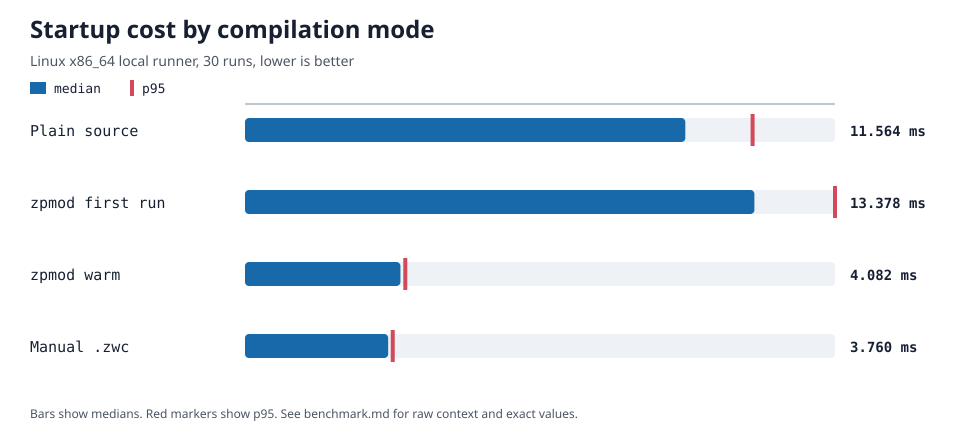

# zpmod

⚙️ Zsh module that transparently and automatically compiles sourced scripts.

`zpmod` is a binary Zsh module (`zmodload`) that gives any Zsh setup automatic `.zwc` compilation of sourced scripts, including setups whose
plugin manager does not compile plugins itself (and setups that don't use a plugin manager at all).

## Quick start

```zsh
# Use the RESOLVED_MODULE_DIR printed by the installer.
module_path+=("/absolute/path/from/RESOLVED_MODULE_DIR")
zmodload -i zpmod

# After the shell starts, profile sourced scripts
zpmod source-study
```

## How it works

```text
source file -> freshness check -> compile or reuse .zwc -> execute -> source-study report
```

zpmod keeps Zsh's native `.zwc` format visible and testable. It automates the freshness check and compilation step, then records source
timing for later inspection. A typical report looks like:

```text
⏱️    3 ms    plugin-a.plugin.zsh
⏱️   12 ms    plugin-b.plugin.zsh
```

Timings vary by machine and shell setup. The report is diagnostic data, not a performance guarantee.

## Measured startup modes



| Mode            |    Median |       p95 |
| --------------- | --------: | --------: |
| Plain source    | 11.564 ms | 13.331 ms |
| zpmod first run | 13.378 ms | 15.495 ms |
| zpmod warm      |  4.082 ms |  4.210 ms |
| Manual `.zwc`   |  3.760 ms |  3.880 ms |

This v2.0.6 result uses the same generated 40-script workload for every mode. The first zpmod run includes compilation; the warm run reuses
generated `.zwc` files; manual `.zwc` is the native Zsh control. See the
[complete result and environment](benchmarks/results/v2.0.6-linux-x86_64/benchmark.md) and [reproducible methodology](benchmarks/README.md).
It is a synthetic comparison, not a universal startup-speed claim.

## Installation

- Traditional system or package install (no `zi`, no network access during the build): see
  [docs/how-to/system-install.md](docs/how-to/system-install.md).
- Install with the CMake helper (`zi`, user, or system scope): see
  [docs/how-to/install-zpmod-with-cmake.md](docs/how-to/install-zpmod-with-cmake.md).
- Install to a custom directory: see [docs/how-to/install-custom-dir.md](docs/how-to/install-custom-dir.md).

`--install-zi` follows Zi's active path configuration. Without a loaded Zi, it retains a recognized legacy `$HOME/.zi` home and otherwise
uses the absolute XDG data home or `$HOME/.local/share`. It never migrates data automatically. Because zpmod is a compiled module, rebuild
it for each incompatible operating system, architecture, or Zsh version instead of sharing one binary install.

## Compatibility

The minimum supported Zsh release is 5.8.1. Prebuilt module compatibility is limited to the platform, architecture, and Zsh combinations
exercised by the release and compatibility workflows. See the [compatibility reference](docs/reference/compatibility.md) for the package ABI
policy and verification coverage.

## Documentation

Full documentation lives under [docs/](docs/index.md), organized as tutorials, how-to guides, reference, and explanation.

## Contributing

See [docs/explanation/contributing.md](docs/explanation/contributing.md).

## License

zpmod contains file-specific licensing. Project-owned module sources marked `SPDX-License-Identifier: MIT` use the
[MIT license](LICENSES/MIT.txt); files without a more specific notice use the [Zsh license](LICENSE). See [NOTICE](NOTICE) for the
package-level scope. The vendored Zsh source remains copyright the Zsh Development Group and retains its own licensing terms.
