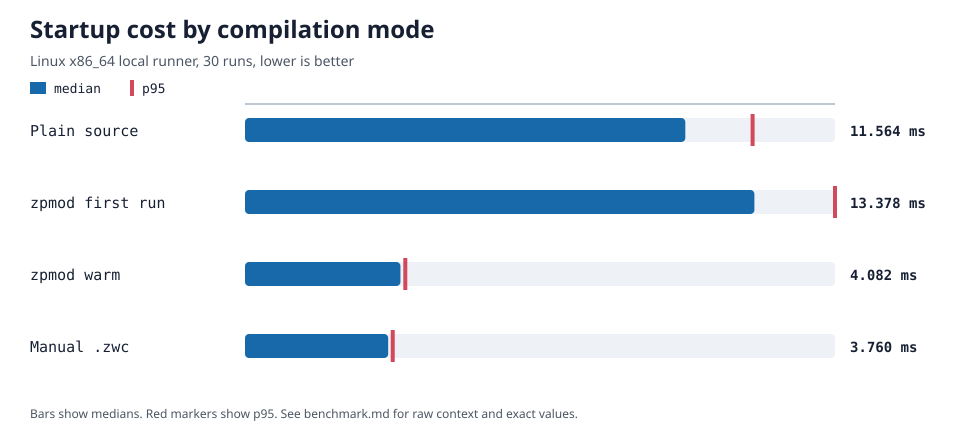

# zpmod

⚙️ Automatic Zsh script compilation and source profiling.

`zpmod` is a binary Zsh module (`zmodload`) that automates Zsh's native `.zwc` compilation of sourced scripts.

Later shell startups can reuse compiled scripts without you manually running `zcompile` after each source update.

It works with or without a plugin manager. Its startup benefit depends on how much time your setup spends parsing scripts.

## Quick start

```zsh
# Use the RESOLVED_MODULE_DIR printed by the installer.
module_path+=("/absolute/path/from/RESOLVED_MODULE_DIR")
zmodload -i zpmod

# After the shell starts, profile sourced scripts
zpmod source-study
```

## How it works

```text
source file -> freshness check -> compile or reuse .zwc -> execute -> source-study report
```

zpmod keeps Zsh's native `.zwc` format visible and testable. It automates the freshness check and compilation step, then records source
timing for later inspection. A typical report looks like:

```text
⏱️    3 ms    plugin-a.plugin.zsh
⏱️   12 ms    plugin-b.plugin.zsh
```

Timings vary by machine and shell setup. The report is diagnostic data, not a performance guarantee.

## Measured startup modes

**The purpose is faster later startups through automatic compilation, with a preparation cost when compilation is needed.**



| Mode            |    Median |       p95 |
| --------------- | --------: | --------: |
| Plain source    | 11.564 ms | 13.331 ms |
| zpmod first run | 13.378 ms | 15.495 ms |
| zpmod warm      |  4.082 ms |  4.210 ms |
| Manual `.zwc`   |  3.760 ms |  3.880 ms |

### Why use zpmod if the first run is slower?

- **Plain source:** Zsh parses the uncompiled scripts on every startup.
- **zpmod first run:** zpmod compiles the scripts during startup, so this run includes extra preparation work.
- **zpmod warm:** a new shell reuses the `.zwc` files saved by an earlier run. This includes later terminals, not just the same session.
- **Manual `.zwc`:** scripts are compiled before timing starts and loaded without zpmod. Compilation work is excluded from this result.

For this workload, later zpmod startups take about 4.1 ms instead of 11.6 ms with plain sourcing, about 65% less time.

Manual compilation is faster here: 3.8 ms versus 4.1 ms. zpmod adds overhead for automation and source profiling.

If your setup already maintains fresh `.zwc` files, these results show no additional startup-speed benefit from adding zpmod.

When a source file is newer than its `.zwc`, zpmod attempts to rebuild it. Missing compiled files also require preparation again.

Compilation avoids reparsing scripts; it does not eliminate the commands they execute during startup.

### Scope of the measurement

This v2.0.6 result uses the same synthetic 40-script workload for every mode on one local Linux x86_64 runner.

Each sample starts a fresh `zsh -f` process with isolated `HOME` and `ZDOTDIR`. This is shell-configuration isolation.

The published metadata does not identify a container image. The graph therefore does not establish container-isolated performance.

It does not represent your actual `.zshrc`, and "first run" does not mean the operating-system filesystem cache was cleared.

See the [complete result and environment](benchmarks/results/v2.0.6-linux-x86_64/benchmark.md).

The [benchmark methodology](benchmarks/README.md) describes sampling, isolation controls, and limitations.

## Installation

- Traditional system or package install (no `zi`, no network access during the build): see
  [docs/how-to/system-install.md](docs/how-to/system-install.md).
- Install with the CMake helper (`zi`, user, or system scope): see
  [docs/how-to/install-zpmod-with-cmake.md](docs/how-to/install-zpmod-with-cmake.md).
- Install to a custom directory: see [docs/how-to/install-custom-dir.md](docs/how-to/install-custom-dir.md).

`--install-zi` follows Zi's active path configuration. Without a loaded Zi, it retains a recognized legacy `$HOME/.zi` home and otherwise
uses the absolute XDG data home or `$HOME/.local/share`. It never migrates data automatically. Because zpmod is a compiled module, rebuild
it for each incompatible operating system, architecture, or Zsh version instead of sharing one binary install.

## Compatibility

The minimum supported Zsh release is 5.8.1. Prebuilt module compatibility is limited to the platform, architecture, and Zsh combinations
exercised by the release and compatibility workflows. See the [compatibility reference](docs/reference/compatibility.md) for the package ABI
policy and verification coverage.

## Documentation

Full documentation lives under [docs/](docs/index.md), organized as tutorials, how-to guides, reference, and explanation.

## Contributing

See [docs/explanation/contributing.md](docs/explanation/contributing.md).

## License

zpmod contains file-specific licensing. Project-owned module sources marked `SPDX-License-Identifier: MIT` use the
[MIT license](LICENSES/MIT.txt); files without a more specific notice use the [Zsh license](LICENSE). See [NOTICE](NOTICE) for the
package-level scope. The vendored Zsh source remains copyright the Zsh Development Group and retains its own licensing terms.
